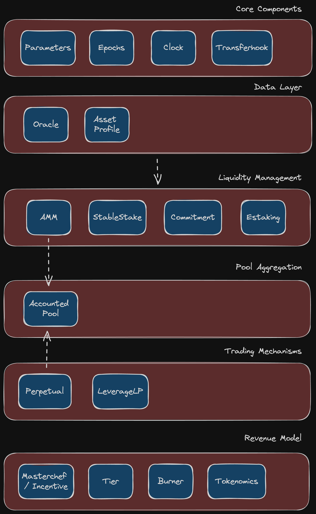

# Architecture Guide

This section contains documentation on the architecture of the Elys chain, including the current design and components of the system.

Click to expand/collapse

## Overview

The diagram below illustrates the architecture of Elys Network, outlining its various modules and their interactions. The system is organized into six layers, each with specific functionalities crucial for the overall operation.

### Layers and Components

1. **Core Components:**

   - **Parameters:** Configuration settings for the overall network.
   - **Epochs:** Time-based intervals for system operations.
   - **Transferhook:** Extends basic IBC transfer capabilities by integrating with the AMM module.

2. **Data Layer:**

   - **Oracle:** Provides external data inputs, such as price feeds.
   - **Asset Profile:** Maintains information about the different assets managed within the network.

3. **Liquidity Management:**

   - **AMM (Automated Market Maker):** Facilitates decentralized trading by maintaining liquidity pools.
   - **StableStake:** Manages staking of stable assets.
   - **Commitment:** Handles token lockups, vesting schedules, and staking interactions.
   - **Estaking:** Extends basic staking capabilities with additional functionalities.

4. **Pool Aggregation:**

   - **Accounted Pool:** Ensures accurate accounting of assets within pools.

5. **Trading Mechanisms:**

   - **Perpetual:** Implements perpetual trading contracts.
   - **LeverageLP:** Enables leverage trading by borrowing assets from the StableStake module.

6. **Revenue Model:**
   - **Masterchef/Incentive:** Manages rewards distribution to liquidity providers.
   - **Tier:** Implements membership tiers for users based on their activity.
   - **Burner:** Handles token burning mechanisms to manage supply.
   - **Tokenomics:** Manages the economic model and token distribution.

### Interaction Flow

The interaction flow between layers is depicted with arrows. Data from the Core Components feeds into the Data Layer. The Liquidity Management layer uses this data to manage liquidity, which is then aggregated in the Pool Aggregation layer. Trading mechanisms utilize the pooled liquidity for various trading activities. The Revenue Model layer ensures economic incentives and sustainability of the system.

## Denom Units

The `denom_units` property is an array of objects, with each object defining a single denomination unit. Each unit object has three properties - `denom`, `exponent`, and `aliases`.

For the ELYS token, there are three denomination units defined with aliases:

- `uelys`: This is the base unit of the ELYS token, and has no aliases.

- `melys`: This unit has an exponent of 3, which means that 1 `melys` is equal to 1000 `uelys`. It has one alias - `millielys`.

- `elys`: This unit has an exponent of 6, which means that 1 `elys` is equal to 1,000,000 `uelys`. It has no aliases.

The aliases for the `melys` unit are specified as `millielys`, which is a common prefix used to denote a thousandth of a unit. These aliases can be used interchangeably with the primary unit names in order to make the values more readable and easier to work with.

## TestNet Parameters

Here are the definitions and current values of each individual parameter of the Elys TestNet Network as of May 8th, 2023.

Click to expand/collapse

### Minting

Defines the rules for automated minting of new tokens. In the current implementation, minting is entirely disabled.

### Staking

Defines the rules for staking and delegating tokens in the network. Validators and delegators must lock their tokens for a certain period to participate in consensus and receive rewards. The `unbonding_time` parameter specifies the duration for which a validator's tokens are locked after they unbond.

- `Max_entries`: The maximum number of entries in the validator set. Current value: 7.
- `Historical_entries`: The number of entries to keep in the historical validator set. Current value: 10,000.
- `Unbonding_time`: The time period for which a validator's tokens are locked after they unbond. Current value: 1,209,600 seconds (equals to 14 days).
- `Max_validators`: The maximum number of validators that can be active at once. Current value: 100.
- `Bond_denom: The denomination used for staking tokens. Current value: `uelys`.

### Governance

Defines the rules for proposing and voting on changes to the network. To make a proposal, a minimum deposit of ELYS is required. The proposal must then go through a voting process where a certain percentage of bonded tokens must vote, and a certain percentage of those votes must be in favor of the proposal for it to pass.

- `Min_deposit`: The minimum amount of ELYS required for a proposal to enter voting. Current value: 10 ELYS.
- `Max_deposit_period`: The maximum period for which deposits can be made for a proposal. Current value: 60.
- `Quorum: The minimum percentage of total bonded tokens that must vote for a proposal to be considered valid. Current value: 33.4%.
- `Threshold`: The minimum percentage of yes votes required for a proposal to pass. Current value: 50%.
- `Veto_threshold`: The percentage of no votes required to veto a proposal. Current value: 33.4%.
- `Voting_period`: The period for which voting on a proposal is open. Current value: 60.

### Distribution

Defines the distribution of rewards and fees in the network. Block proposers receive a portion of the block rewards as an incentive to maintain the network.

- `Base_proposer_reward`: The base percentage of block rewards given to proposers. Current value: 1%.
- `Bonus_proposer_reward`: The additional percentage of block rewards given to proposers if they include all valid transactions. Current value: 4%.

### Slashing

Defines the penalties for validators who violate the network rules or fail to perform their duties. Validators who sign blocks incorrectly or go offline for too long will be penalized with a percentage of their bonded tokens being slashed. The `signed_blocks_window` parameter specifies the number of blocks used to determine a validator's uptime percentage, and the `min_signed_per_window` parameter specifies the minimum percentage of blocks that a validator must sign in each window to avoid being slashed. The `downtime_jail_duration` parameter specifies the duration for which a validator is jailed if they miss too many blocks.

- `Signed_blocks_window`: The number of blocks used to determine a validator's uptime percentage. Current value: 30,000.
- `Min_signed_per_window`: The minimum percentage of blocks that a validator must sign in each window to avoid being slashed. Current value: 5%.
- `Downtime_jail_duration`: The duration for which a validator is jailed if they miss too many blocks. Current value: 600 seconds.
- `Slash_fraction_double_sign`: The percentage of a validator's bonded tokens that are slashed if they double sign. Current value: 0.01%.
- `Slash_fraction_downtime`: The percentage of a validator's bonded tokens that are slashed if they are offline for too long. Current value: 5%.

