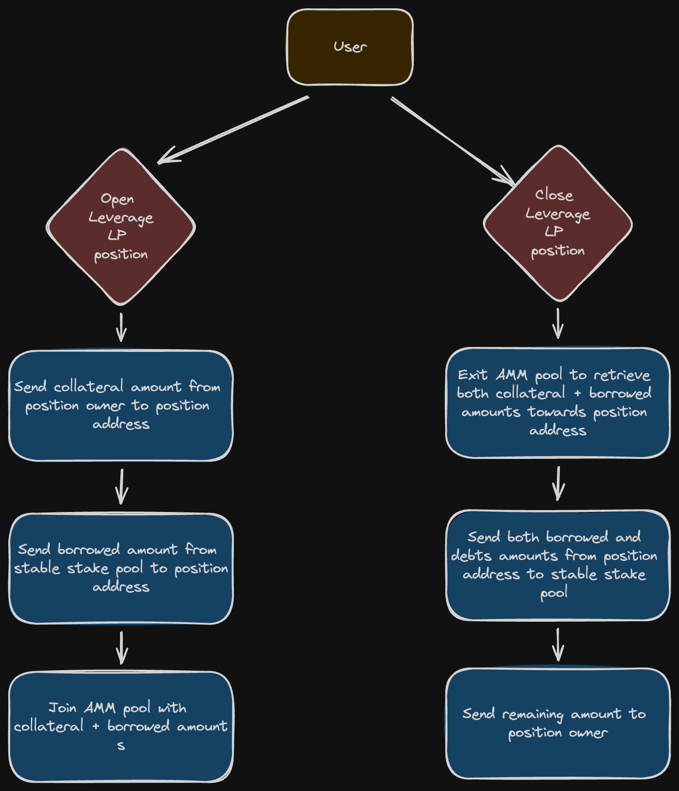

<!--
order: 6
-->

# Position Workflow

This document describes the workflow for opening and closing a leveraged liquidity provision (LP) position. The process involves interactions between the user, a stable stake pool, and an Automated Market Maker (AMM) pool.

## 1. Opening a Leveraged LP Position

### Step 1: Initiate Position Opening

- **Action**: User decides to open a leveraged LP position.
- **Trigger**: User sends a request to open a position.

### Step 2: Send Collateral Amount

- **Action**: The user sends a collateral amount from their address to the position address.
- **Details**:
  - **Source**: User's wallet (position owner)
  - **Destination**: Position address
  - **Amount**: Collateral specified by the user

### Step 3: Send Borrowed Amount

- **Action**: The system sends the borrowed amount from the stable stake pool to the position address.
- **Details**:
  - **Source**: Stable stake pool
  - **Destination**: Position address
  - **Amount**: Borrowed funds required for leverage

### Step 4: Join AMM Pool

- **Action**: The system joins the AMM pool with the combined collateral and borrowed amounts.
- **Details**:
  - **Source**: Position address
  - **Destination**: AMM pool
  - **Amount**: Collateral + Borrowed funds

## 2. Closing a Leveraged LP Position

### Step 1: Initiate Position Closing

- **Action**: User decides to close the leveraged LP position.
- **Trigger**: User sends a request to close the position.

### Step 2: Exit AMM Pool

- **Action**: The system exits the AMM pool to retrieve both the collateral and borrowed amounts towards the position address.
- **Details**:
  - **Source**: AMM pool
  - **Destination**: Position address
  - **Amount**: Collateral + Borrowed funds

### Step 3: Send Borrowed and Debts Amounts

- **Action**: The system sends both borrowed and debt amounts from the position address to the stable stake pool.
- **Details**:
  - **Source**: Position address
  - **Destination**: Stable stake pool
  - **Amount**: Borrowed funds + Accrued interest/debts

### Step 4: Return Remaining Amount

- **Action**: The system sends the remaining amount back to the position owner.
- **Details**:
  - **Source**: Position address
  - **Destination**: User's wallet (position owner)
  - **Amount**: Remaining collateral after settling the debt

# Components Involved

1. **User**: The entity initiating the opening and closing of leveraged LP positions.
2. **Position Address**: The smart contract or designated address handling the position-specific funds.
3. **Stable Stake Pool**: The liquidity source providing borrowed funds for leverage from StableStake module.
4. **AMM Pool**: The decentralized exchange pool where liquidity is provided from AMM module.

# Sequence of Actions

## Opening Position

1. User sends a request to open a leveraged LP position.
2. Collateral is transferred from the user's wallet to the position address.
3. Borrowed funds are transferred from the stable stake pool to the position address.
4. The position address joins the AMM pool with the total funds.

## Closing Position

1. User sends a request to close the leveraged LP position.
2. The position address exits the AMM pool, retrieving the collateral and borrowed amounts.
3. Borrowed and debt amounts are transferred from the position address to the stable stake pool.
4. Remaining collateral is sent back to the user's wallet.
