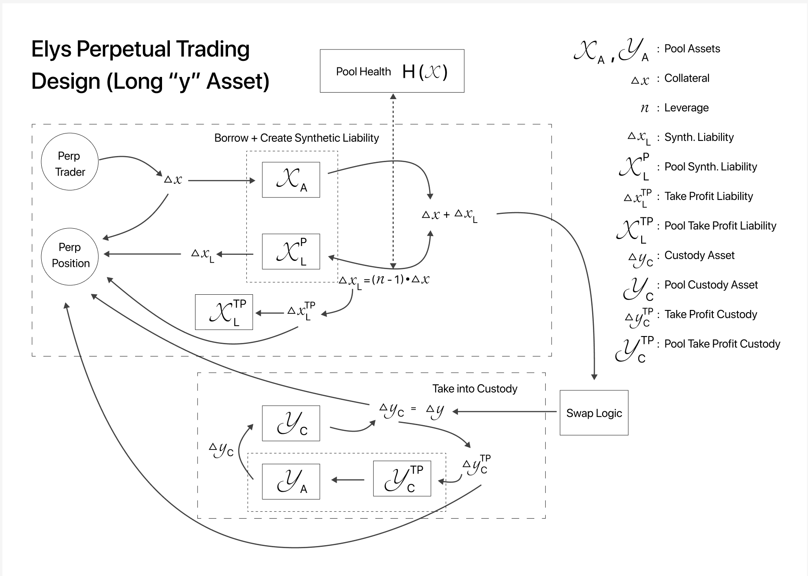

<!--
order: 2
-->

# Mechanism

The following section provides a detailed technical explanation of the perpetual trading mechanism as depicted in the Elys Perpetual Trading Design diagram.

## Overview

The Elys Perpetual Trading system facilitates leveraged trading on assets without the need for expiry dates on positions. This design ensures continuous trading opportunities and flexibility, which are essential features in the cryptocurrency market. The system is designed to manage the complex interactions between various entities and components, ensuring the stability and security of the trading platform.

The module allows participants to leverage their trading positions by borrowing either the traded asset liquidity or USDC, depending on the direction of the trade (long or short). For long trades, participants borrow either the traded asset liquidity or USDC to increase their exposure to the traded asset, while for short trades, they borrow the traded asset itself to bet against its price. This mechanism ensures that the borrowed assets are appropriately managed and tracked within the Perpetual module, providing a flexible and efficient trading experience.

## Components

### Symbols and Definitions

- **$X_A, Y_A$**: Pool Assets
- **$\Delta x$**: Collateral
- **$n$**: Leverage
- **$\Delta x_L$**: Synthetic Liability
- **$X_L^P$**: Pool Synthetic Liability
- **$\Delta x_L^{TP}$**: Take Profit Liability
- **$X_L^{TP}$**: Pool Take Profit Liability
- **$\Delta y_C$**: Custody Asset
- **$Y_C$**: Pool Custody Asset
- **$\Delta y_C^{TP}$**: Take Profit Custody
- **$Y_C^{TP}$**: Pool Take Profit Custody

### Key Entities

- **Perp Trader**: The trader participating in perpetual trading.
- **Perp Position**: The open position taken by the trader.
- **Swap Logic**: The mechanism for swapping assets within the pool.
- **Pool Health $H(X)$**: A metric indicating the health of the pool, influenced by the assets and liabilities.

## Workflow

### 1. Borrow and Create Synthetic Liability

1. The Perp Trader deposits collateral $\Delta x$.
2. The collateral $\Delta x$ is added to the Pool Assets $X_A$.
3. A synthetic liability $\Delta x_L$ is created based on the leverage $n$, calculated as:
   $\Delta x_L = (n - 1) \cdot \Delta x$
4. The synthetic liability $\Delta x_L$ is recorded as Pool Synthetic Liability $X_L^P$.

### 2. Position Opening

1. The Perp Position is updated with the new synthetic liability $\Delta x_L$.
2. The take profit liability $\Delta x_L^{TP}$ is calculated and added to the Pool Take Profit Liability $X_L^{TP}$.

### 3. Custody and Asset Management

1. The equivalent custody asset $\Delta y_C$ is determined and taken into custody.
2. This custody asset $\Delta y_C$ is added to the Pool Custody Asset $Y_C$.
3. The take profit custody $\Delta y_C^{TP}$ is also calculated and added to the Pool Take Profit Custody $Y_C^{TP}$.

### 4. Swap Logic

The system employs swap logic to facilitate asset exchanges within the pool, ensuring the appropriate custody and liabilities are maintained.

### 5. Pool Health Management

The overall health of the pool $H(X)$ is continually monitored, ensuring that the pool remains solvent and capable of covering all positions and liabilities.

### Summary of Flow

The flow diagram illustrates the interaction between the Perp Trader, the Perp Position, and the various pool components. The process involves depositing collateral, creating synthetic liabilities, managing custody assets, and using swap logic to maintain pool health and facilitate perpetual trading.

### Note on Short Positions

The diagram illustrates the long position scenario. The mechanism for short positions is essentially the same, but with the roles of $X$ and $Y$ reversed. This means that for short positions, the Perp Trader deposits $Y$ as collateral, and the system manages the corresponding synthetic liabilities, custody assets, and swaps accordingly.

## Technical Specification

The perpetual trading mechanism is designed to ensure that:

- Traders can open leveraged positions without expiry dates.
- The system dynamically manages collateral, synthetic liabilities, and custody assets.
- Pool health is continuously monitored to prevent insolvency.
- Swaps and asset exchanges within the pool are efficiently handled to maintain liquidity and stability.

The implementation ensures that all participants can trade with confidence, knowing that the system is robust and capable of handling the complexities of perpetual trading.

## Dependencies

The Perpetual module depends on two other modules:

1. **AccountedPool**: Manages the accounting of the pools usage between the AMM and the Perpetual modules.
2. **AMM**: Facilitates liquidity provision and trading.

## Key Equations

To maintain the stability and health of the pool, the following equations are used:

1. **Pool Health**

   The Pool Health formula is designed to evaluate the stability and risk associated with the assets in a trading pool. It takes into account the balances of the assets, the synthetic liabilities for both long and short positions, and the take profit liabilities for these positions. The formula is given by:

   $$\text{Pool Health} = \prod_\text{Asset}{\frac{\text{Asset Balance}}{\text{Asset Balance} + \text{Pool Synthetic Liabilities}\_\text{long} - \text{Pool Take Profit Liabilities}\_\text{long}}} \times \prod_\text{Asset}{\frac{\text{Asset Balance}}{\text{Asset Balance} + \text{Pool Synthetic Liabilities}\_\text{short} - \text{Pool Take Profit Liabilities}\_\text{short}}}$$

   **Components of the Formula**

   - **Asset Balance**: The current amount of the asset available in the pool.
   - **Pool Synthetic Liabilities (long)**: The total synthetic liabilities created from long positions for the asset.
   - **Pool Take Profit Liabilities (long)**: The liabilities associated with take profit levels for long positions on the asset.
   - **Pool Synthetic Liabilities (short)**: The total synthetic liabilities created from short positions for the asset.
   - **Pool Take Profit Liabilities (short)**: The liabilities associated with take profit levels for short positions on the asset.

   **Interpretation**

   - **Long Position Component**: The term $$\frac{\text{Asset Balance}}{\text{Asset Balance} + \text{Pool Synthetic Liabilities}\_\text{long} - \text{Pool Take Profit Liabilities}\_\text{long}}$$ calculates the ratio of the asset balance to the net synthetic liabilities (considering take profit liabilities) for long positions. This ratio indicates how well the pool's asset balance can cover the synthetic liabilities of long positions. A higher ratio implies a healthier pool.

   - **Short Position Component**: Similarly, the term $$\frac{\text{Asset Balance}}{\text{Asset Balance} + \text{Pool Synthetic Liabilities}\_\text{short} - \text{Pool Take Profit Liabilities}\_\text{short}}$$ calculates the ratio for short positions. It shows the pool's ability to cover synthetic liabilities for short positions.

   - **Product of Ratios**: The overall pool health is determined by taking the product of these ratios across all assets. This comprehensive measure ensures that both long and short synthetic liabilities are considered for each asset in the pool.

   **Purpose**

   The Pool Health metric is monitored to ensure it does not fall below the Safety Factor threshold, which is set at 5%. Lower Pool Health indicates higher risk of leveraged positions being liquidated.

2. **Position Health and Liquidation Mechanism**:

   The Position Health formula is used to evaluate the risk level of an individual trading position by comparing the amount of assets held in custody to the total liabilities and unpaid borrow interest. The formula is given by:

   $$\text{Position Health} = \frac{\text{Custody Amount}}{\text{Liabilities} + \text{Borrow Interest Unpaid}}$$

   - **Custody Amount**: The total value of assets currently held in custody for the position. This represents the collateral or assets secured to back the position.
   - **Liabilities**: The total amount of liabilities associated with the position. This includes any borrowed amounts that the trader is responsible for repaying.
   - **Borrow Interest Unpaid**: The total amount of unpaid interest accrued on the borrowed liabilities. This includes any interest that has not yet been paid by the trader.

   If Position Health falls below the Safety Factor threshold (5%), the perpetual position is automatically liquidated to protect the underlying liquidity pool.
